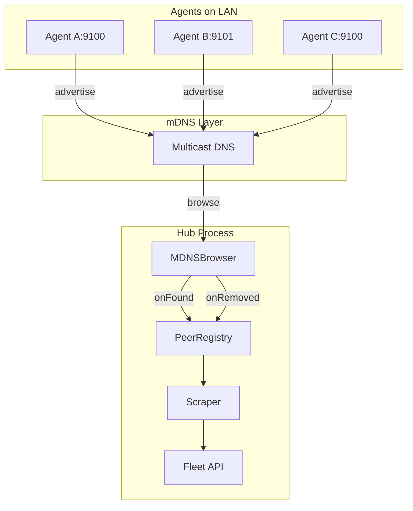

# mDNS Auto-Discovery for Zero-Config Fleet Monitoring

## Architecture



## Key Files

| File | Purpose |
|------|---------|
| `internal/discovery/mdns.go` | New: MDNSAdvertiser + MDNSBrowser |
| `internal/discovery/mdns_test.go` | New: Unit tests |
| `internal/hub/hub.go` | Wire browser into Start(), self-filter, dedup |
| `internal/config/config.go` | Default mdns_enabled=true when hub enabled; add output.mdns_advertise |
| `cmd/agent/main.go` | Start advertiser for all agents (when Prometheus + mdns_advertise) |

## Implementation Details

### 1. Discovery Package (`internal/discovery/`)

**Dependency:** Add `github.com/grandcat/zeroconf` to go.mod.

**MDNSAdvertiser:**
- `NewAdvertiser(deviceName, port, version, deviceCount)` → registers `_keldron._tcp` service
- TXT records: `version=0.1.0`, `device_name=...`, `device_count=1` (use 1 for MVP; can derive from adapter count later)
- `Stop()` calls `server.Shutdown()`
- Wrap `zeroconf.Register()` in recover/graceful handling — log warning and return nil on failure (requirement #9)

**MDNSBrowser:**
- `NewBrowser(onFound func(addr, deviceName), onRemoved func(addr))`
- `Start(ctx)` — browse `_keldron._tcp` continuously
- **onRemoved:** Zeroconf does not emit explicit "removed" events. Implement 30s re-browse loop with diff: each cycle collect current entries, compare to previous set, call `onRemoved` for addresses that disappeared.
- On context cancel: stop resolver, exit cleanly

**Address format:** Use first IPv4 from `entry.AddrIPv4`; fallback to IPv6 or hostname. Port from `entry.Port`. Format: `ip:port` (e.g. `192.168.1.50:9100`).

### 2. Hub Integration (`internal/hub/hub.go`)

In `Start()` (replace lines 134–136):

```go
if h.config.MDNSEnabled {
    browser := discovery.NewBrowser(
        func(addr, name string) {
            if h.isSelf(addr, name) { return }
            h.logger.Info("discovered peer via mDNS", "peer", name, "address", addr)
            h.registry.AddPeer(addr)  // AddPeer already dedupes by address
        },
        func(addr string) {
            h.logger.Info("peer disappeared from mDNS", "address", addr)
            h.registry.MarkUnhealthy(addr)
        },
    )
    go func() {
        if err := browser.Start(ctx); err != nil && ctx.Err() == nil {
            h.logger.Warn("mDNS discovery unavailable — using static peers only", "error", err)
        }
    }()
}
```

**Self-filtering:** Add `isSelf(addr, deviceName string) bool`:
- Compare `deviceName` to `h.deviceName` (exact match → self)
- Parse addr; if host is local IP (from `net.InterfaceAddrs()`) and port matches hub's Prometheus port, skip

**Deduplication:** `PeerRegistry.AddPeer` already checks `if _, ok := r.peers[address]; !ok` before adding — no duplicate entries.

**Graceful failure:** `browser.Start` returns error if zeroconf init fails. Log warning, do not return/crash. Hub continues with static peers.

### 3. Hub Self-Filtering and Prometheus Port

Extend `NewHub` to accept `prometheusPort int` (from `cfg.Output.PrometheusPort`). Store in Hub struct. Use in `isSelf()`.

### 4. Agent Advertisement (`cmd/agent/main.go`)

All agents advertise when:
- `cfg.Output.Prometheus` is true (they expose /metrics)
- **`cfg.Output.MDNSAdvertise` is true (default)** — add this config flag for opt-out flexibility. When false, skip advertiser (e.g. corporate networks where mDNS causes issues).

**Logic:** When `isLocalMode` and `cfg.Output.Prometheus` and `cfg.Output.MDNSAdvertise`:
- Create advertiser with `deviceName`, `PrometheusPort`, `version`, `deviceCount=1`
- Start advertiser; call `advertiser.Stop()` on shutdown (when closing outputs)

### 5. Config Changes (`internal/config/config.go`)

**mdns_enabled default when hub enabled:** Use `*bool` for `MDNSEnabled` in `HubConfig` so we can distinguish "unset" vs "explicitly false". When `Hub.Enabled` and `MDNSEnabled == nil`, resolved value is `true`. When `MDNSEnabled != nil`, use `*MDNSEnabled`. Add helper `MDNSEnabled() bool` on HubConfig.

**output.mdns_advertise:** Add `MDNSAdvertise bool` to `OutputConfig`, default `true`. When false, main.go skips starting the advertiser.

### 6. Tests

**Unit tests (mdns_test.go):**
- `TestNewAdvertiser` — creates service with correct type and TXT
- `TestBrowserOnFound` — start advertiser, start browser, verify onFound called with correct addr/name
- `TestSelfFiltering` — hub's isSelf returns true for own device_name and own ip:port
- `TestDeduplication` — AddPeer twice with same address → single peer

**Integration:** Start agent A (advertise), agent B (hub + browse), wait, curl fleet API. Note: localhost mDNS can be flaky; document manual two-machine test.

### 7. Git Workflow

1. `git checkout -b feat/OSS-022-mdns-discovery`
2. Implement changes
3. Push and open PR with provided template

## Resolved Decisions (from recommendations)

| Decision | Choice |
|----------|--------|
| **mdns_advertise opt-out** | Add `output.mdns_advertise: true` (default) for flexibility |
| **device_count in TXT** | Use 1 for MVP |
| **onRemoved implementation** | Implement 30s re-browse loop with diff for onRemoved |
